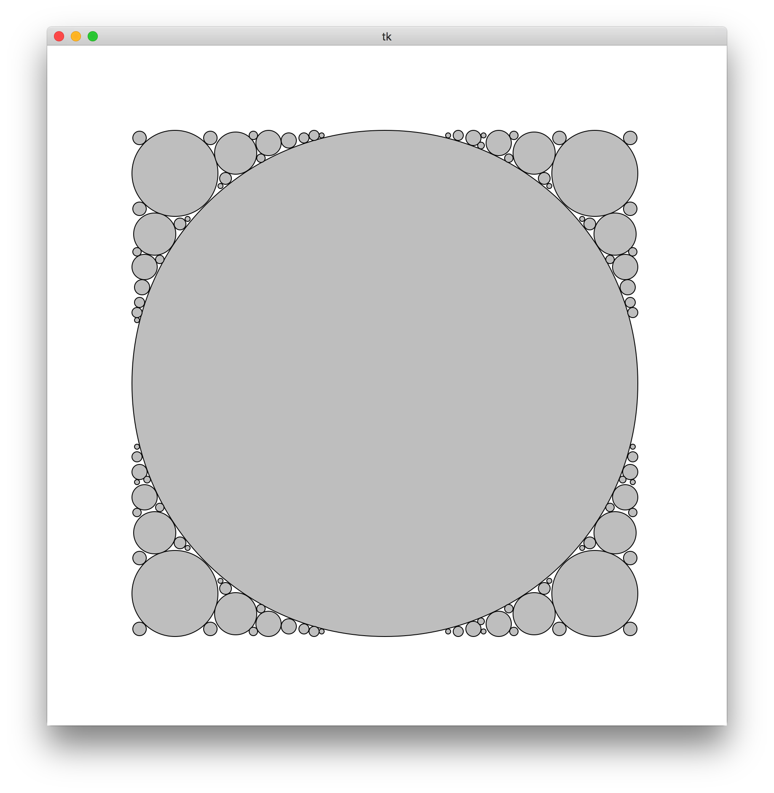

# <center>软件工程上机实验报告</center>
# <center>Project 1</center>
### <center>姓名：杨晨 班级：软件工程1506班 学号：U201517138</center>
## 问题描述
Project 1:
In a box bounded by [-1, 1], given m balloons(they cannot overlap) with variable radio r and position mu, find the optimal value of r and mu which maximize sum r^2
## 算法描述
对于该问题使用数值解法，将坐标的变化步长设置为<code>inc = 0.01</code>，半径的变化步长初始设置为<code>radius_inc = 0.1</code>。每放一个圆，都从正方形的的左下角开始，不断对坐标进行<code>x += inc, y += inc</code>操作，并对每一个坐标计算出相应的该位置的最大半径，得到一个最大的圆之后，将其记录在一个动态分配空间的链表中。
最大半径的计算方法：对于每一个坐标位置，不断增加该坐标的圆的半径大小，即<code>circle.radius += radius\_inc</code>。首先判断该圆是否在边界内，即判断<code>abs(circle.x) + circle.radius, abs(circle.y)+circle.radius</code>与1的大小关系。其次，遍历链表中存在的圆，如果当前圆与链表中任意圆的圆心距大于它们的半径和，则该圆符合条件。依次将半径增加的步长减少，直到获得一个满足条件的最大的圆，并将它放入到链表中。
## 结构和测试单元
### 定义的数据存储结构

```c
struct circle
{
    double x;
    double y;
    double radius;
};
typedef struct circle Circle;

struct circle_list
{
    Circle circle;
    struct circle_list * next;
    
};
typedef struct circle_list CircleList;
```
### 关键逻辑函数

```c
int valid(Circle circle)
{
    
    double result = _abs(circle.x) + circle.radius;
    
    if(((_abs(circle.x) + circle.radius) > 1) || ((_abs(circle.y) + circle.radius) > 1))
    {
        return 0;
    }
    CircleList * current = head;
    
    while(current)
    {
        if(distance(current->circle, circle) < current->circle.radius + circle.radius)
            
        {
            return 0;
        }
        
        current = current->next;
        
    }
    return 1;
}
```
```c
void addCircle()
{
    Circle circle = {-1 + inc, -1 + inc, 0};
    Circle max_circle = circle;
    int i, j;
    for(i = 0; circle.x < 1; i++)
    {
        circle.x += inc;
        circle.y = -1 + inc;
        for(j = 0; circle.y < 1; j++)
        {
            circle.y += inc;
            circle.radius= 0;
            double radius_inc = 0.1;
            
            while(radius_inc > 0.00001)
            {
                if(circle.radius > max_circle.radius)
                {
                    max_circle = circle;
                    
                }
                circle.radius += radius_inc;
                
                if(!valid(circle))
                {
                    circle.radius -= radius_inc;
                    radius_inc /= 10;
                }
            }
        }
    }
    
    if(valid(max_circle))
    {
        addToList(max_circle);
        radius_sum += max_circle.radius * max_circle.radius;
        printf("x坐标：%f， y坐标：%f, 半径：%f\n", max_circle.x, max_circle.y, max_circle.radius);
        
    }
    return;
}
```

### 单元测试
写好了关键函数之后，对各个函数进行独立的调用，使用不同的测试用例来进行：

| Circle number | x  | y  |radius|valid()返回值|
|:-------------:|:---:|:---:|:--:|:----------:|
| 1             | -1  | -1  | 1  |0           |
| 2             |-0.88|-0.83|0.9 |0           |
| 3             |-0.83| 0.83|0.11|1           |

## 实验结果
在macOS环境下，使用tkinter库绘图，得出程序的运行结果：
### 100个圆
<center></center>

## 实验总结
1.根据绘图结果，发现该算法的精确度并不高，因为坐标的位置只精确到小数点后两位，半径只精确到小数点后5位。所以该算法只是对原问题运用了数值解法得到的一个近似解。
2.该算法的时间复杂度比较高，因为每一个圆都需要循环100*100次，而在每一个循环中还有一个<code>while</code>循环。导致该算法的循环次数较多，导致程序运行时间较长。

##附录
### Git log
<center></center>