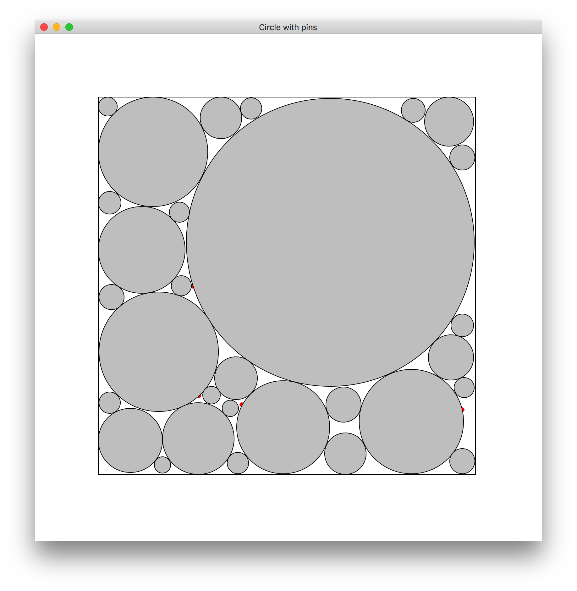
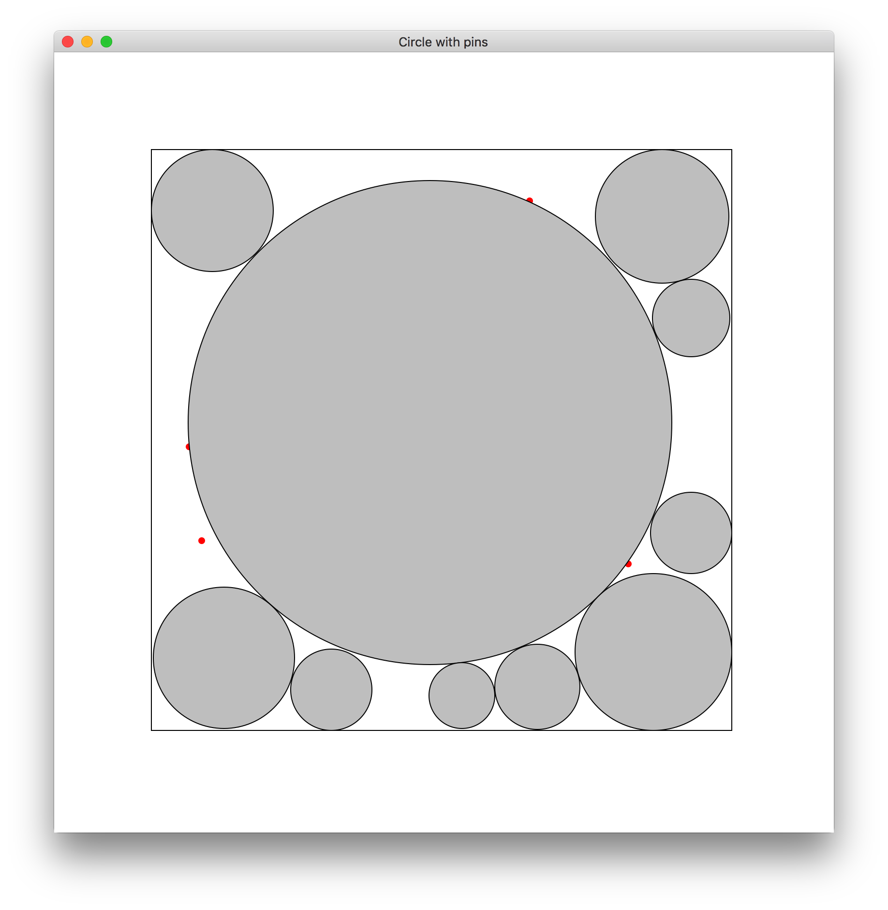

# <center>软件工程上机实验报告</center>
# <center>Project 2</center>
### <center>姓名：杨晨 班级：软件工程1506班 学号：U201517138</center>
### <center>结伴：蒋志远 软件工程1506班 学号：U20151749
## 问题描述
Project 2:
In a box bounded by [-1, 1], given m balloons(they cannot overlap) with variable radio r and position mu. And some tiny blocks are in the box at given position {d};balloons cannot overlap with these blocks. find the optimal value of r and mu which maximizes 
sum r^2
## 算法描述以及改进过程
### 基本算法
对于该问题使用数值解法。

1. 首先在正方形中取1000*1000的等距点阵，作为圆心的备选点。每次放一个圆之前，遍历所有备选点，在每个备选点上将圆的半径逐渐扩大，直到该圆不再满足题目中的条件时停止。记录下符合条件的半径最大的圆对应的中心坐标和半径，并存储在一个数组中。

2. 判断圆是否符合条件的方法：若圆超过[-1,1]边界，则不符合条件，若圆与数组中的任何一个圆有所重叠，则不符合条件。其他情况均符合条件。

**3.project2只需在project1的基础上，加入一个向用户请求钉子的数量和位置的步骤。然后将这些钉子视为半径为0的“圆”。将这些“圆”事先放在数组中，即可以达到题目所述要求。**

### 局部优化
基本算法中，每次都需要遍历1000\*1000的点阵，浪费了很多时间。所以可以先将1000\*1000的点阵坐标存储在一个数组中，每次放一个圆，就将该圆中的点从点阵数组中删除，可以减少后面的循环次数。


## 结构和测试单元
### 关键函数实现

```python
class Circle():
    center = (0, 0) 
    radius = 0
    def __init__(self, center, radius):
        self.center = center
        self.radius = radius

    def calAria(self):
        return math.pi*self.radius*self.radius
    
    def description(self):
        return ("Center: (% f, % f)\tRadius:%.10f"
        		%(self.center[0], self.center[1], self.radius))

    def distance(circle1, circle2):
        return math.sqrt(
        			(circle1.center[0]-circle2.center[0])**2
        		   +(circle1.center[1]-circle2.center[1])**2)
    def copy(self):
        return Circle(self.center, self.radius)
        
def mathmatic_solution(m, pointList, circleList = []):
    radius_sum = 0
    center_step = 0.01
    for i in range(0, m):
        maxcircle = Circle((0,0),0)
        circle = 0
        for point in pointList:
            circle = Circle(point, 0)
            radius_step = 0.1
            while radius_step > 1e-5:
                if circle.radius > maxcircle.radius:
                    maxcircle = circle.copy()
                circle.radius += radius_step
                if not valid(circle, circleList):
                    circle.radius -= radius_step
                    radius_step /= 10
        if valid(maxcircle, circleList):
            circleList.append(maxcircle)
            radius_sum += maxcircle.radius**2
        pointList = list(
        				filter(
        				lambda point: 
        				valid(Circle(point, 0), circleList),
        				pointList))

    return circleList
```

### 单元测试
写好了关键函数之后，对各个函数进行独立的调用，使用不同的测试用例来进行：

| Circle number | x  | y  |radius|valid()返回值|
|:-------------:|:---:|:---:|:--:|:----------:|
| 1             | -1  | -1  | 1  |0           |
| 2             |-0.88|-0.83|0.9 |0           |
| 3             |-0.83| 0.83|0.11|1           |

## 实验结果
在macOS环境下，使用tkinter绘图库，得出程序的运行结果：
<center></center>

## 实验总结
1. 根据绘图结果，发现该算法的精确度并不高，因为坐标的位置只精确到小数点后两位，半径只精确到小数点后5位。所以该算法只是对原问题运用了数值解法得到的一个近似解。
2. 图中可以看出有一些圆并没有相切，因为计算机精度的原因，计算时会出现舍入误差，因为画图是映射到像素，所以每个点的间距被扩大了300倍，所以造成有缘没有相切

##附录
### Git log
```
commit b9805791d602bdaf1e6b54436d743dcbc550d32c
Author: ChAnYaNG97 <790194334@qq.com>
Date:   Thu Jun 1 17:13:48 2017 +0800

    add pictures

commit 801f2f067a25410b7a58da98030f4194b52e1aad
Author: ChAnYaNG97 <790194334@qq.com>
Date:   Thu Jun 1 16:52:25 2017 +0800

    add reports

commit f26b0d0043b1107abbb3e29d9603c3b9fea91dd4
Author: ChAnYaNG97 <790194334@qq.com>
Date:   Thu Jun 1 16:50:00 2017 +0800

    add reports

commit 90145474f66d066a154b68a80184bffec33d41ad
Author: BluesJiang <763400095@qq.com>
Date:   Thu Jun 1 16:48:23 2017 +0800

    add block

commit 78037db21cbf1a8ed5dabcaec93c87f6a3752614
Merge: 2d98dec 21d5a13
Author: BluesJiang <763400095@qq.com>
Date:   Thu Jun 1 16:33:27 2017 +0800

    comma conflict

commit 2d98decdae4bc292c4aaffa8bb24019e316b8b15
Author: BluesJiang <763400095@qq.com>
Date:   Thu Jun 1 16:32:32 2017 +0800

    comma

commit 21d5a13c0d7fb17317a2337da2d3fdb67e6e6463
Author: ChAnYaNG97 <790194334@qq.com>
Date:   Thu Jun 1 16:25:05 2017 +0800

    delete comma

commit 41ff89e80dfab167f85a3a7ec72a46bd3309ff12
Merge: 85e80bc 74e49b3
Author: ChAnYaNG97 <790194334@qq.com>
Date:   Thu Jun 1 16:23:30 2017 +0800

    conflict fixed

commit 85e80bca92d8bab2363aac92420c59142932fd66
Author: ChAnYaNG97 <790194334@qq.com>
Date:   Thu Jun 1 16:14:30 2017 +0800

    draw

commit 74e49b3589957c380187adc3ae5191ebcd379fdc
Author: BluesJiang <763400095@qq.com>
Date:   Thu Jun 1 16:13:57 2017 +0800

    accelerate

commit 403f67663bf1b80ca336f2bb9eaaaa2572496551
Author: BluesJiang <763400095@qq.com>
Date:   Thu Jun 1 15:09:37 2017 +0800

    fix some bug

commit ec93a62e3e7d904221826f8d849e3345a021f6b0
Merge: f5eb45d d82cba8
Author: BluesJiang <763400095@qq.com>
Date:   Thu Jun 1 14:54:23 2017 +0800

    fix comflict

commit f5eb45d86bc23f997e728682be3082a995c97438
Author: BluesJiang <763400095@qq.com>
Date:   Thu Jun 1 14:50:13 2017 +0800

    translate addCicle

commit d82cba85e78f028f3c50c9e724a9a92691d0ee8a
Author: ChAnYaNG97 <790194334@qq.com>
Date:   Thu Jun 1 14:46:25 2017 +0800

    some corrections

commit cda36f61a8aa18d7f4e4ff72883012b05a6617dc
Author: ChAnYaNG97 <790194334@qq.com>
Date:   Thu Jun 1 14:44:58 2017 +0800

    implement the valid() function

commit 65f387a5482643e791efe8374bc684574f2f2681
Author: BluesJiang <763400095@qq.com>
Date:   Thu Jun 1 14:32:17 2017 +0800

    add distance

commit 9e9c441469f16ee13c8797c1fb0817bc846a0eb2
Author: BluesJiang <763400095@qq.com>
Date:   Thu Jun 1 11:43:50 2017 +0800

    fix when m < 3 ,result goes wrong

commit 834494816cb0729923c505ecef89a2ee0131e7bd
Author: BluesJiang <763400095@qq.com>
Date:   Thu Jun 1 10:56:47 2017 +0800

    bug fixed

commit 017a074fc3b1b28dc07fd1314ae2fb13aa485ecd
Author: BluesJiang <763400095@qq.com>
Date:   Thu Jun 1 10:30:55 2017 +0800

    clear the formula

commit c851ac95780a02f307bbac35886900cb99cc4af2
Author: BluesJiang <763400095@qq.com>
Date:   Fri May 5 20:45:27 2017 +0800

    sub_solution

```