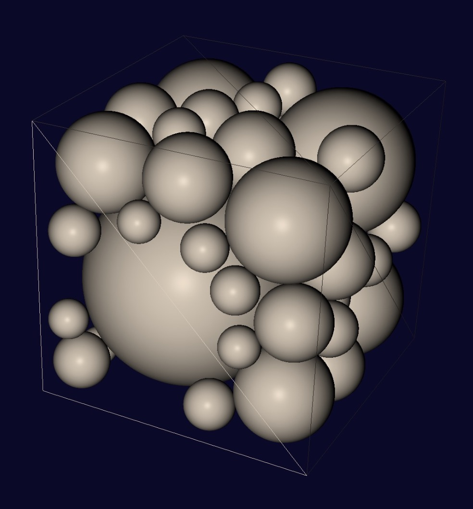

# <center>软件工程上机实验报告</center>
# <center>Project 3</center>

|姓名|学号|班级|
|:---:|:----:|:---:|
|蒋志远|U201517149|软工1506|
|杨晨|U201517138|软工1506|
|李露阳|U201517132|软工1506|

## 问题描述
Project 3:
In a box(3D) bounded by $[-1, 1]$, given m balloons(they cannot overlap) with variable radio $r$ and position $mu$. And some tiny blocks are in the box at given position ${d}$;balloons cannot overlap with these blocks. find the optimal value of $r$ and $mu$ which maximizes $\sum r^3$
## 算法描述以及改进过程
### 基本算法
对于该问题使用数值解法。

1. 首先在正方体中中取$200\times200\times200$的等距点阵，作为球心的备选点。每次放一个球之前之前，遍历所有备选点，在每个备选点求出可以满足条件的最大半径。记录下符合条件的半径最大的圆对应的中心坐标和半径，并存储在一个数组中。

2. 求球的最大半径的方法：记球心的坐标为$(x,y,z)$,半径为$r$,则在$|x-1|$, $|x+1|$, $|y+1|$, $|y-1|$, $|z+1|$, $|z-1|$和与各个已存在的球相切的半径中选出一个最小的值，即为当前满足条件的最大的球的半径。


### 局部优化
基本算法中，每次都需要遍历$200\times200\times200$的点阵，浪费了很多时间。所以可以先将$200\times200\times200$的点阵坐标存储在一个数组中，每次放一个球，就将该球中的点从点阵数组中删除，可以减少后面的循环次数。


## 结构和测试单元
### 关键函数实现

```java
//找出(x,y,z)点处的最大半径
public double MaxValidRadius(double x, double y, double z) {
        ArrayList<Double> radiusList = new ArrayList<>();
        radiusList.add(Math.abs(x + 1));
        radiusList.add(Math.abs(x - 1));
        radiusList.add(Math.abs(y + 1));
        radiusList.add(Math.abs(y - 1));
        radiusList.add(Math.abs(z + 1));
        radiusList.add(Math.abs(z - 1));

        Point p = new Point(x, y, z);

        Circle tmp = new Circle(p, 0);

        for (Circle circle : circleList) {
            radiusList.add(distance(tmp, circle) - circle.radius);
        }


        for (Point pin : pinList) {
            Circle _pin = new Circle(pin, 0);
            radiusList.add(distance(tmp, _pin));
        }


        double max_radius = radiusList.get(0);
        for (double radius : radiusList) {
            if (radius < max_radius) {
                max_radius = radius;
            }
        }

        return max_radius;


    }
```

### 单元测试
写好了关键函数之后，对各个函数进行独立的调用，使用不同的测试用例来进行：

| Circle number | x   | y   | z   |maxValidRadius()返回值|
|:-------------:|:---:|:---:|:---:|:----------:|
| 1             | -0.4| -0.5| 0.3 |0.5         |
| 2             |-0.68|0.43 |-0.65|0.32        |
| 3             |-0.13|-0.4 |0.8  |0.2         |

## 实验结果
在macOS环境下，使用javafx绘图库，得出程序的运行结果：
<center></center>

## 实验总结
1. 根据绘图结果，发现该算法的精确度并不高，因为坐标的位置只精确到小数点后两位,所以该算法只是对原问题运用了数值解法得到的一个近似解。
2. 图中可以看出有一些圆并没有相切，因为计算机精度的原因，计算时会出现舍入误差，因为画图是映射到像素，所以每个点的间距被扩大了200倍，所以造成有缘没有相切

##附录
### Git log
```
commit c12a13f3671af659be707929f46e5dcf0aa15f02
Author: ChAnYaNG97 <790194334@qq.com>
Date:   Fri Jun 16 13:31:07 2017 +0800

    java version for project3

commit 6938b22c23a099983b0a7c5c8ead37fd79e78560
Author: BluesJiang <763400095@qq.com>
Date:   Mon Jun 5 16:15:10 2017 +0800

    改进代码写法

commit 85e7b24f94742a96d9231071d982b9df71efdae4
Author: BluesJiang <763400095@qq.com>
Date:   Mon Jun 5 13:57:58 2017 +0800

    改进加速算法

commit cc276badfc702ee4b658e4d6e35d3ffa115769b8
Author: BluesJiang <763400095@qq.com>
Date:   Thu Jun 1 20:48:54 2017 +0800

    modified for good looking
```